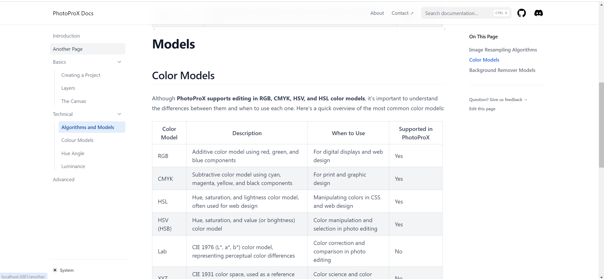

# PhotoProXDocs

PhotoProXDocs is a simple and easy to learn the ropes of PhotoProX.

The live version of the project can be found [here](https://photoproxdocs.vercel.app).



## Installation

To install PhotoProXDocs, you can simply download the repository or clone it using the following command:

```bash
git clone
```

You'll also need to install npm and node.js to run the project. You can download them from [here](https://nodejs.org/en/download/).

Once node is installed, you can run the following command to install the required dependencies:

```bash
npm install
```

## Usage

To run the project, you can use the following command:

```bash
npm run dev
```

You should see the following message in the terminal:

```bash
Server started on http://localhost:3000
```

You can now open your browser and navigate to `http://localhost:3000` to view the project.

Have fun!

## Acknowledgements

This project was built using a [Nextra](https://nextra.site/) template. You can find the original respotory [here](https://github.com/shuding/nextra-docs-template)

## License

This project is licensed under the MIT License - see the [LICENSE](LICENSE) file for details.
