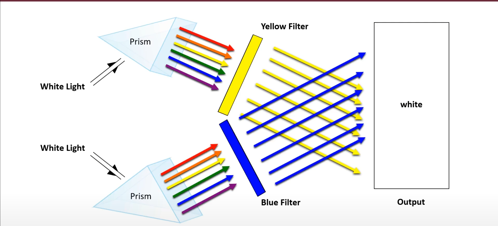

# Colour Models

## Introduction

A color model is a **mathematical model** describing the way colors can be represented as **[tuples of numbers](https://www.w3schools.com/python/python_tuples.asp)**, typically as three or four values or color components. When this model is associated with a precise description of how the components are to be interpreted (viewing conditions, etc.), the resulting set of colors is called "color space." This section describes the **most popular color models, including RGB, CMYK, HSL, and HSV**.

## Some Helpful Prerequsite Knowledge

Before we dive into the color models, let's quickly review some basic concepts in **color science** that will help us understand the color models better.

### 1. Additive and Subtractive Color mixing

This may be tough to admit, but we all have been mixing colours since we were kids. Remember when you mixed red and blue paint to get purple? Or when you mixed yellow and blue paint to get green? That's color mixing! However, our definition of color mixing is a bit different from what we learned in art class and they sort of lied to us about the real primary colors.

- **Additive Color Mixing**: Additive color mixing is the process of creating colors by mixing **light** of two or more different colors. **When all the primary colors are combined, white light is produced**.

Black does not exist in the additive colour model. This is because since this model involves the mixing of light, since no light is absorbed by the colours, there is no way to get black.

Our eyes preceive colour using the additive colour model. There is a lot of science behind this, and we won't go into it here, but it is important to know that the additive colour model is how we see colour. For more information on how our eyes see colour, check out [this article](https://www.livescience.com/38174-how-humans-see-in-color.html).

Caption: Blue light mixing with yellow light to create white light (Image Credit: [Wikipedia](https://en.wikipedia.org/wiki/Subtractive_color)

**Overview of the Additive Colour Mixing Model**

| Primary Colors | Complements | Mixing               | Product of Mixing All Primary Colors |
| -------------- | ----------- | -------------------- | ------------------------------------ |
| Red            | Cyan        | Red + Green = Yellow | **White**                            |
| Green          | Magenta     | Green + Blue = Cyan  | ...                                  |
| Blue           | Yellow      | Blue + Red = Magenta | ...                                  |

- **Subtractive Color Mixing**: Subtractive color mixing is the process of creating colors by mixing **pigments** of two or more different colors. **When all the primary colors are combined, black is produced**.
  For instance, a red pigment absorbs all colors except red, which it reflects and transmits to our eyes. This model is used when we are doing physical art like painting or printing.

  We remember the primary colours as red, blue, and yellow, but perhaps red was mean't to be magenta, blue is cyan, and yellow is yellow. Oh well, we were close :)

  White does not exist in the subtractive colour model. This is because since this model involves the absorbtion of light, since white is the presenece of all colours, there is no way to get white if something is absorbing all the colours.

  
  Caption: Magenta pigement absorbing green and reflecting blue and red light (Image Credit: [Wikipedia](https://en.wikipedia.org/wiki/Subtractive_color))

**Overview of the Subtractive Colour Mixing Model**
| Primary Colors | Complements | Mixing | Product of Mixing All Primary Colors |
| -------------- | ----------- | ---------------------- | ------------------------------------ |
| Cyan | Red | Cyan + Magenta = Blue | **Black** |
| Magenta | Green | Cyan + Yellow = Green | ... |
| Yellow | Blue | Magenta + Yellow = Red | ... |

#### Mixing a Primary Color with its Complement

The complement of a primary color is the color that is produced by mixing the other two primary colors. For example, the complement of red is cyan, the complement of green is magenta, and the complement of blue is yellow. When you mix a primary color with its complement, you get white light in additive color mixing and black in subtractive color mixing.
This is because since the complement of a color is the color that is produced by mixing the other two primary colors, when you mix a primary color with its complement, you are mixing all the primary colors together, which results in either white light or black pigment depending on the color mixing model.

### 2. Color Spaces

A color space is a specific organization of colors. In combination with physical device profiling, it allows for reproducible representations of color, in both analog and digital representations. A color space may be arbitrary, with particular colors assigned to a set of physical color swatches and corresponding assigned color names, or structured mathematically (for example, as a set of three or four vectors or color components).
